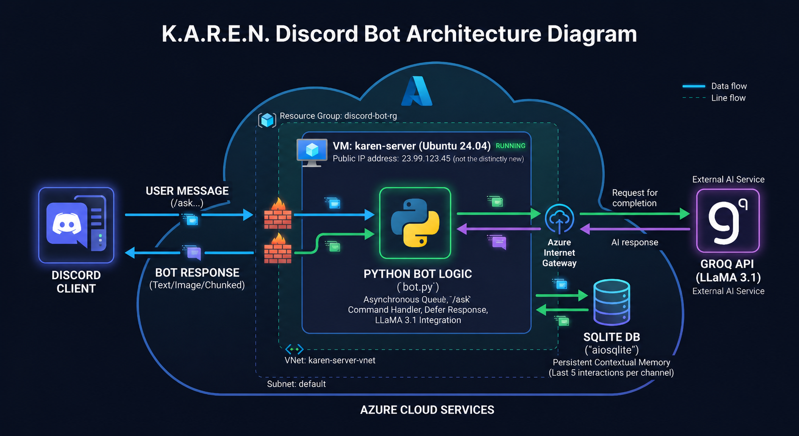

# K.A.R.E.N. Discord Assistant

An AI-powered Discord bot utilizing the Groq API (LLaMA 3.1) to answer questions and maintain conversational context. Built with Python, this project demonstrates asynchronous task management, local database integration, and cloud deployment.

Link: https://discord.com/oauth2/authorize?client_id=1507976528653189160

## Architecture Diagram


## Features

* **Slash Commands:** Seamless integration with Discord's native UI using the `/ask` command.
* **Conversational Memory:** Uses an asynchronous SQLite database (`aiosqlite`) to remember the last 5 interactions per channel, maintaining context like a real conversation.
* **Asynchronous Queue:** Implements a producer-consumer pattern (`asyncio.Queue`) to safely buffer and handle multiple user requests without freezing the bot.
* **Smart Chunking:** Automatically slices long AI responses to respect Discord's 2000-character message limit.
* **Cloud Deployed:** Hosted 24/7 on an Azure Ubuntu Virtual Machine.

## Tech Stack

This project served as a practical learning experience for understanding intermediate software engineering and infrastructure concepts:

* **Discord API (`discord.py`):** Learned how to register and handle modern slash interactions and defer responses.
* **Asynchronous Flow:** Explored `asyncio` to prevent network requests (like calling the Groq API) from blocking the main execution loop.
* **Database Management:** Learned how to use SQL (`DELETE FROM ... NOT IN`) to implement a sliding-window memory system so the database doesn't grow infinitely.
* **Cloud Infrastructure:** Successfully navigated SSH key permissions, Linux package management, and used `tmux` to keep the bot running in the background on an Azure VM.

## Local Setup

If you want to run this bot locally, follow these steps:

### Prerequisites
* Python 3.8+
* A Discord Bot Token (from the Discord Developer Portal)
* A Groq API Key

### Installation

1.  **Clone the repository:**
    ```bash
    git clone https://github.com/yourusername/karen-bot.git
    cd karen-bot
    ```

2.  **Create a virtual environment and install dependencies:**
    ```bash
    python3 -m venv venv
    source venv/bin/activate  # On Windows use: venv\Scripts\activate.bat
    pip install -r requirements.txt
    ```

3.  **Configure Environment Variables:**
    Create a file named `.env` in the root directory and add your keys:
    ```env
    DISCORD_TOKEN=your_discord_bot_token_here
    GROQ_API_KEY=your_groq_api_key_here
    ```

4.  **Run the Bot:**
    ```bash
    python bot.py
    ```
